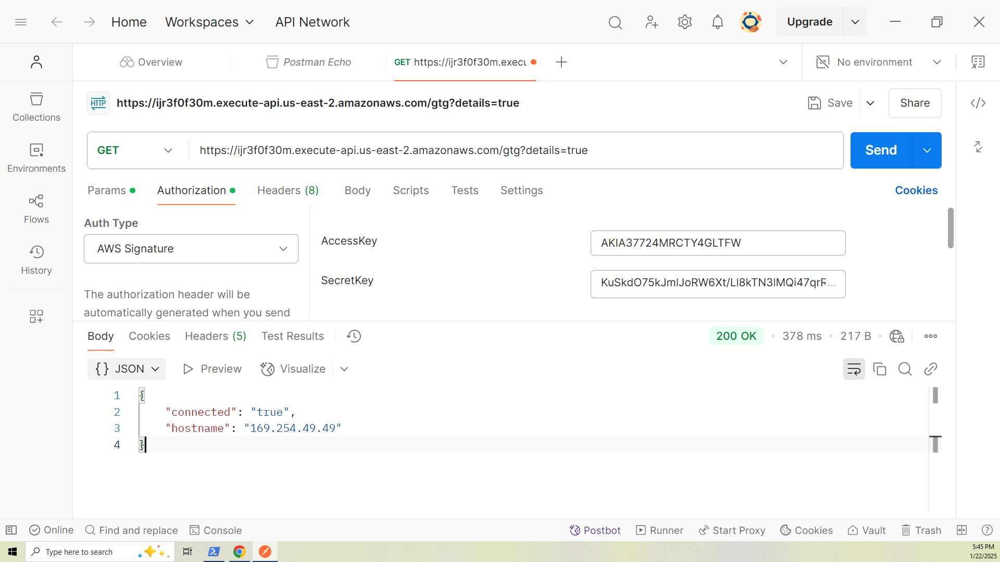

# Deploying Serverless HTTP Endpoints with AWS Lambda and API Gateway

This video complements the [AWS Autoscaling](https://youtu.be/aBMM6vjC8d0) tutorial, where we deployed a simple microservice using Python and the Flask framework with AWS Autoscaling and EC2 instances.

In this video, we will deploy a set of Python-based serverless functions in AWS. This involves creating Lambda functions and attaching HTTP endpoints to those Lambdas using API Gateway. These endpoints will replicate the functionality of the API deployed in the [AWS Autoscaling project](https://github.com/mamonaco1973/aws-flask-asg/blob/main/README.md).

By the end of this video, you will learn how to deploy Python-based HTTP endpoints as serverless functions on AWS using Terraform.

### Key Tasks Covered:

1. **Deploy Python Code**: Create microservices using AWS Lambda functions.
2. **Utilize DynamoDB**: Use a document database for microservice data storage.
3. **Configure HTTP Endpoints**: Set up API Gateway to invoke the serverless functions.
4. **Secure HTTP Endpoints**: Implement IAM integration for endpoint security.
5. **Clean Up Resources**: Safely destroy all infrastructure created during the deployment process.


## Serverless Computing with AWS

Serverless computing is a cloud-computing execution model where AWS dynamically manages the infrastructure, including server provisioning, scaling, and maintenance. This approach allows developers to focus entirely on writing and deploying code, without the need to manage or maintain underlying servers. A key use case for serverless computing is building and managing **HTTP endpoints**, making it a powerful solution for web applications, APIs, and microservices.

### Key Characteristics of AWS Serverless Computing

- **No Server Management**: Developers don't need to manage or provision servers; AWS takes care of the underlying infrastructure, allowing more focus on application logic.
- **Automatic Scaling**: AWS serverless applications, including HTTP endpoints, automatically scale up or down based on demand, ensuring consistent performance regardless of traffic volume.
- **Pay-As-You-Go**: Costs are based on actual usage (e.g., number of requests or function execution time), providing cost-efficiency for workloads with varying traffic patterns.

### AWS Lambda and API Gateway for Serverless HTTP-Based Solutions

Serverless computing in AWS is commonly associated with **AWS Lambda**, a Functions-as-a-Service (FaaS) platform. When combined with **Amazon API Gateway**, it provides a seamless and powerful solution for managing HTTP(S) requests and routing them to serverless functions. 

- **AWS Lambda**: Executes code in response to HTTP(S) requests, triggered by API Gateway, without the need to provision or manage servers. Lambda functions automatically scale to handle varying levels of traffic and are billed based on execution time and the number of invocations.

- **Amazon API Gateway**: Acts as a fully managed service to create, publish, and secure RESTful or HTTP APIs. It routes incoming requests to Lambda functions, handles request validation and throttling, and provides monitoring and logging.

The combination of AWS Lambda and API Gateway enables developers to build scalable, cost-effective, and fully serverless web applications, APIs, and microservices.


## Prerequisites

* [An AWS Account](https://aws.amazon.com/console/)
* [Install AWS CLI](https://docs.aws.amazon.com/cli/latest/userguide/getting-started-install.html) 
* [Install Latest Terraform](https://developer.hashicorp.com/terraform/install)
* [Install Postman](https://www.postman.com/downloads/) for testing

If this is your first time watching our content, we recommend starting with this video: [AWS + Terraform: Easy Setup](https://youtu.be/BCMQo0CB9wk). It provides a step-by-step guide to properly configure Terraform, Packer, and the AWS CLI.

## Download this Repository

```bash
git clone https://github.com/mamonaco1973/aws-flasky-lambdas.git
cd aws-flasky-lambdas
```

## Build the Code

Run [check_env](check_env.sh) then run [apply](apply.sh).

```bash
~/aws-flasky-lambdas$ ./apply.sh
NOTE: Validating that required commands are found in your PATH.
NOTE: aws is found in the current PATH.
NOTE: packer is found in the current PATH.
NOTE: terraform is found in the current PATH.
NOTE: All required commands are available.
NOTE: Checking AWS cli connection.
NOTE: Successfully logged into AWS.
NOTE: Zipping lambda code into lambda.zip
  adding: flask-candidate-get.py (deflated 68%)
  adding: flask-candidate-post.py (deflated 64%)
  adding: flask-candidates-get.py (deflated 63%)
  adding: flask-gtg.py (deflated 62%)
NOTE: Building API Gateway and Lambdas
Initializing the backend...
Initializing provider plugins...
- Finding latest version of hashicorp/aws...
- Installing hashicorp/aws v5.84.0...
[...]
```

### Build Process Overview

The build process consists of two distinct phases:

#### 1. Packaging the Python Code
- The Python code is zipped during this phase.
- A checksum of the ZIP file is calculated and referenced in the Terraform configuration.
- This ensures that any changes to the Python code will trigger a re-deployment when you run [apply.sh](apply.sh) again.

#### 2. Deploying the Infrastructure
- This phase executes the Terraform code to build the AWS Lambda functions and the API Gateway.

#### Final Validation
- After the build completes, the [validate.sh](validate.sh) script is run to verify the solution and ensure everything is functioning as expected.

## Tour of Build Output in the AWS Console

Most of the build can be accessed on the **API Gateway** and **AWS Lambdas** pages of the AWS Console.

- **The API Gateway**


- **The AWS Lambdas**


## *Flasky* Endpoint Summary

- [AWS Lambda Source Code](./01-lambdas/code)

### `/gtg` (GET)
- **Purpose**: Health check.
- **Response**: 
  - `{"connected": "true", "instance-id": <instance_id>}` (if `details` query parameter is provided).
  - 200 OK with no body otherwise.

### `/candidate/<name>` (GET)
- **Purpose**: Retrieve a candidate by name.
- **Response**: 
  - Candidate details (JSON) with status `200`.
  - `"Not Found"` with status `404` if no candidate is found.

### `/candidate/<name>` (POST)
- **Purpose**: Add or update a candidate by name.
- **Response**: 
  - `{"CandidateName": <name>}` with status `200`.
  - `"Unable to update"` with status `500` on failure.

### `/candidates` (GET)
- **Purpose**: Retrieve all candidates.
- **Response**: 
  - List of candidates (JSON) with status `200`.
  - `"Not Found"` with status `404` if no candidates exist.

## Securing HTTP Endpoints with IAM Authentication

In the initial deployment of this project, the HTTP endpoints were deployed without any access controls, allowing anyone on the public internet to connect to them. In this section, we will secure the endpoints using **IAM Authentication** and test the setup with Postman.

### Steps to Secure and Test the Endpoints

#### 1. Modify the `authorization_type` Variable

Update the `authorization_type` variable in the [01-lambdas\variables.tf](01-lambdas\variable.tf) file to **AWS_IAM**.

```tf
variable "authorization_type" {
  description = "What type of authorization to require on the routes"
  type        =  string
  default     =  "AWS_IAM"
#  default     = "NONE" 
}
```
#### 2. Apply the Terraform Configuration

Run the `apply.sh` script to re-deploy the infrastructure with the updated authorization setting.

#### 3. Retrieve IAM Credentials for API Access

Output the AWS access key and secret key for the IAM user created to access the API. This user is scoped to the API deployed in this project.

```bash
~/aws-flasky-lambdas$ cd 01-lambdas/
~/aws-flasky-lambdas/01-lambdas$ terraform output -json
{
  "access_key_id": {
    "sensitive": true,
    "type": "string",
    "value": "<ACCESS_KEY_ID>"
  },
  "secret_access_key": {
    "sensitive": true,
    "type": "string",
    "value": "<SECRET_ACCESS_KEY>"
  }
}
```

#### 4. Validate Authentication Enforcement

Run the `validate.sh` script. You should see Forbidden errors for all API requests because IAM authentication is now required.

```bash
~/aws-flasky-lambdas$ ./validate.sh
NOTE: Testing the API Gateway Solution.
NOTE: URL for API Solution is https://ijr3f0f30m.execute-api.us-east-2.amazonaws.com/gtg?details=true
✗ good to go failed: Forbidden
✗ insert failed: Forbidden
✗ verification failed: Forbidden
✗ candidate list failed: Forbidden
```
#### 5. Test APIs with Postman

Use Postman to test the endpoints by setting the IAM credentials in the Authorization tab. Without the authentication headers, the endpoints will return a `403 Forbidden` status code.



